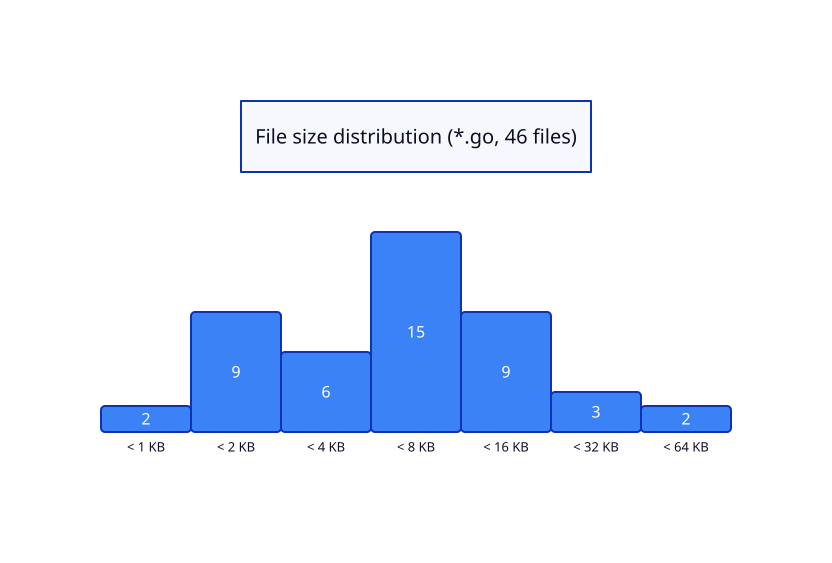

# oida

*Oida* is Austrian slang, the Viennese worn-down form of the German **Alter**
("old man"). It started life as a way to address a mate — roughly "dude" or
"mate" — and grew into the most flexible word in the dialect: depending purely
on intonation, **Oida!** means surprise, disbelief, admiration, warning,
resignation or mild outrage. There is a well-known Austrian joke of a complete
conversation held in nothing but *Oida*, each repetition carrying a different
meaning. That is the spirit of this package: one small thing you drop into your
code that tells you what is really going on — usually the moment you open a
trace and mutter it yourself.

---

`oida` is in-process telemetry for Go services. It records traces and spans into
a ring buffer inside your process and serves a server-side rendered UI at
`/debug/oida` where you can list recorded traces and drill into any one of them:
a proportional timeline, the span tree, attributes, errors and per-trace memory
accounting.

No agent. No collector. No exporter. No JavaScript.

## Install

```bash
go get github.com/titpetric/oida
```

## Use

```go
opts := oida.NewOptions()
opts.ServiceName = "billing-api"

tracer, err := oida.Configure(opts)
if err != nil {
	return err
}
opts.Tracer = tracer

r := chi.NewRouter()
r.Use(oida.TracingMiddleware(opts))

if err := oida.Mount(r, opts); err != nil {
	return err
}
```

Then instrument anything, anywhere below the middleware:

```go
ctx, span := oida.Start(ctx, "SELECT users", oida.KindDatabase)
defer span.End()
span.SetAttribute("limit", limit)
```

Open `http://localhost:8080/debug/oida`.

## Features

- **Traces and spans** with real parent/child nesting, kinds, attributes,
  recorded errors and source locations.
- **Ring buffer storage** — bounded memory, no persistence, no I/O.
- **Sampling** — deterministic rate sampling or a custom `Sampler`.
- **Server-side rendered UI** built with [templ](https://templ.guide): trace
  list, live view, rolling statistics, per-trace detail with a timeline.
- **The trace as a waveform** — every span drawn along the stretch it ran for
  and overlaid on one line, so concurrency reads as brightness. Canvas, drawn
  from the page's own data, no build step. See
  [docs/screenshots.md](docs/screenshots.md).
- **Live streaming** — the live view is pushed over server sent events as
  traces are recorded, driven by `Tracer.Subscribe()` rather than a timer.
- **Content negotiation** — HTML in a browser, JSON for `Accept:
  application/json`, plain text for `curl`.
- **Background work** — `Observe` records jobs and cron ticks into the same
  buffer as HTTP requests.
- **Pluggable retention** — `StorageMemory` by default, `StorageDisk` when
  traces should survive a restart, or your own six-method implementation.
- **Nil-safe instrumentation** — code instrumented with oida runs unchanged
  where oida is disabled, unsampled or absent.
- **One dependency**: the templ runtime. (chi appears in `go.mod` only for the
  `tests` helper and the `cmd/oida` demo — importing `oida` does not pull it in.)

## Documentation

| Document | Contents |
| --- | --- |
| [docs/screenshots.md](docs/screenshots.md) | What the front end looks like, view by view |
| [docs/guide-getting-started.md](docs/guide-getting-started.md) | Wiring into `chi/v5` and `net/http` |
| [docs/guide-instrumentation.md](docs/guide-instrumentation.md) | Creating and closing spans, patterns for SQL, HTTP, cache, goroutines |
| [docs/guide-configuration.md](docs/guide-configuration.md) | `Options` reference, sampling, sizing, YAML |
| [docs/architecture.md](docs/architecture.md) | Design, concurrency model, prior art |
| [docs/spec-model.md](docs/spec-model.md) | Data model specification |
| [docs/spec-api.md](docs/spec-api.md) | Public API specification |
| [docs/spec-frontend.md](docs/spec-frontend.md) | `/debug/oida` routes and components |
| [docs/conventions.md](docs/conventions.md) | File layout and code conventions |

## Demo

A runnable chi/v5 service with cache, database, external and background work
lives in [cmd/oida/](cmd/oida/):

```bash
go run ./cmd/oida            # http://localhost:8080/debug/oida
```

The same command is the payload of the Docker image:

```bash
docker compose up -d         # titpetric/oida:latest, http://oida.localhost
```

## Development

```bash
atkins                       # the full pipeline: tidy, templ, fmt, test, build, docker
```

Individually:

```bash
templ generate               # regenerate view_*_templ.go after editing .templ files
go test -race ./...
atkins templ:verify          # fail when the generated components are stale
atkins go:build              # bin/oida-linux-amd64
atkins docker:build          # titpetric/oida:latest from docker/Dockerfile
```

`github.com/titpetric/oida/tests` gives your own tests a ready made
oida-instrumented chi server:

```go
server := tests.NewHTTPServer(t)
```

The screenshots in [docs/screenshots.md](docs/screenshots.md) are generated from
a running instance, one PNG per component:

```bash
scripts/demo.sh              # writes docs/assets/*.png
```

## Dependencies

Importing `oida` pulls in one thing: the templ runtime. Everything else here is
build time or demo time, and nothing is required to run the package in your
service.

| Dependency | What it's used for |
| --- | --- |
| [github.com/a-h/templ](https://github.com/a-h/templ) | The only runtime import. The front end is templ components rendered on the server; `templ generate` produces the committed `view_*_templ.go`. |
| [github.com/titpetric/atkins](https://github.com/titpetric/atkins) | The pipeline, in CI and on a laptop alike: `go mod tidy`, generate, format, test, build, image. `atkins` is the whole build. |
| [github.com/titpetric/exp](https://github.com/titpetric/exp) | `go-fsck` extracts the package structure and renders the architecture diagrams; `go-ddd-stats` measures the size chart below. |
| [github.com/titpetric/tools](https://github.com/titpetric/tools) | `gofsck` lints the file layout rules: one struct per file, data models in `model.go`. |
| [github.com/go-chi/chi](https://github.com/go-chi/chi) | Router for the `cmd/oida` demo and the `tests` helper. In `go.mod`, not in your binary: importing `oida` does not pull it in. |
| [github.com/terrastruct/d2](https://github.com/terrastruct/d2), [plantuml](https://github.com/plantuml/plantuml) | Render the generated diagrams under `docs/assets/`. Needed only by `atkins gen`. |

## Size

Every `.go` file in the repository, by size. Most of them are under 8 KB and
none of them is a warehouse, because the conventions do not allow one: one
struct per file, data models in `model.go`, and `gofsck` fails the build over
it. Small enough to read in an afternoon, which is the point: telemetry you
cannot audit is telemetry you have to trust.



Regenerate it, and the architecture diagrams beside it, with `atkins gen`.

## License

MIT
