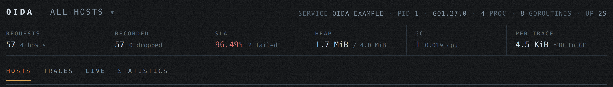

# oida



oida records what a Go service does and serves the result at `/debug/oida`. A trace is one unit of work, an HTTP request or a background job. The spans under it are the operations that unit of work performed, each with its duration, attributes and errors. Traces are held in a ring buffer inside the process, so there is no collector to run and nothing leaves the machine.

Use it to see which requests are slow, which operations failed, how work nests, and what memory a request used.

## Install

```bash
go get github.com/titpetric/oida@latest
```

## Use with the standard library

```go
opts := oida.NewOptions("billing-api")
opts.Enabled = true

tracer, err := oida.New(opts)
if err != nil {
	return err
}

mux := http.NewServeMux()
mux.HandleFunc("GET /users/{id}", getUser)

if err := oida.Mount(mux, tracer); err != nil {
	return err
}

return http.ListenAndServe(":8080", tracer.Middleware(mux))
```

## Use with go-chi

```go
opts := oida.NewOptions("billing-api")
opts.Enabled = true

tracer, err := oida.New(opts)
if err != nil {
	return err
}

r := chi.NewRouter()
r.Use(tracer.Middleware)
r.Get("/users/{id}", getUser)

if err := oida.Mount(r, tracer); err != nil {
	return err
}

return http.ListenAndServe(":8080", r)
```

`oida.Mount` serves the dashboard under the path the tracer was configured with, and takes a `chi.Router` or an `*http.ServeMux` alike. The tracer is an `http.Handler` of its own, so `mux.Handle("/debug/oida/", tracer)` works where one pattern is enough.

Recording is opt-in: set `opts.Enabled` in code, or leave it alone and set `OIDA_ENABLED=true` in the environment. Open `http://localhost:8080/debug/oida`.

## Instrument the work below it

The middleware records the request. Spans record what the request did:

```go
func GetUsers(ctx context.Context) (UserList, error) {
	ctx, span := oida.Start(ctx, "SELECT users", oida.KindDatabase)
	defer span.End()

	span.SetAttribute("limit", 100)

	// implementation...
}
```

Pass the returned `ctx` down, and the next `oida.Start` records a child span. The kind drives the colour in the timeline and the grouping of the segment sweep; the [span kinds](docs/spec-model.md#span-kinds) and the [attribute keys](docs/spec-model.md#attributes) the dashboard reads are documented with the rest of the data model. Every call is nil-safe, so instrumented code runs unchanged where no tracer was built, or where the request was not sampled.

## What it covers

- HTTP requests and background jobs
- Nested spans with kinds, attributes, errors, and source locations
- Bounded in-memory retention, or disk documents that outlive the process, chosen in code or from the environment
- Rate sampling and custom sampling rules
- Live activity, retained traces, route statistics, and trace details
- HTML for browsers, JSON for tools, and plain text for terminals
- Nil-safe instrumentation when tracing is absent or a request is not sampled

## Documentation

[docs/](docs/README.md) covers getting started, instrumentation, configuration, the public API, the data model and the dashboard.

`github.com/titpetric/oida` is the public API: one import covers instrumenting, mounting and configuring, and [docs/api.md](docs/api.md) is its generated reference. The `frontend`, `model` and `storage` packages serve the root package and carry no compatibility promise of their own.

## License

MIT
