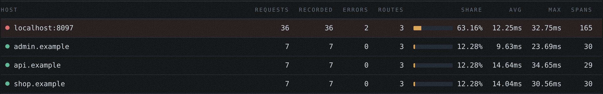
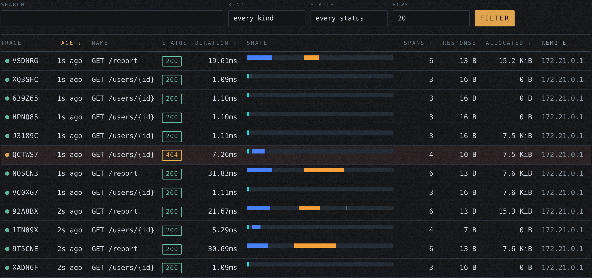
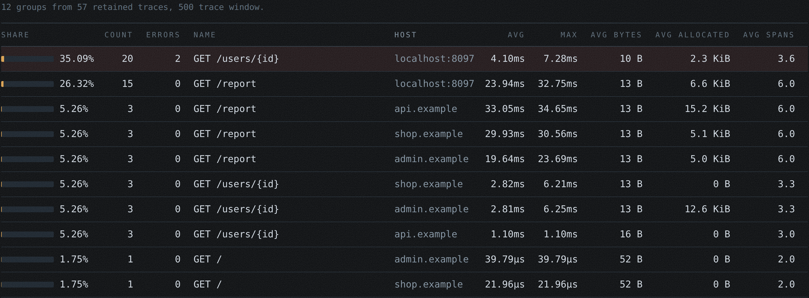
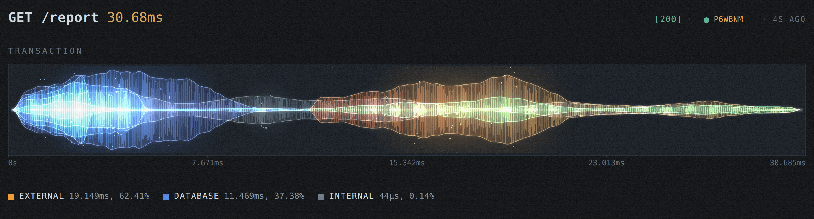
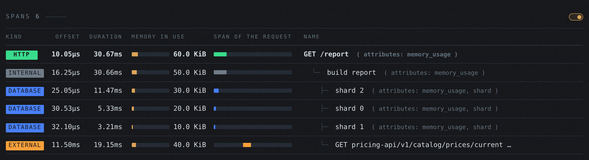
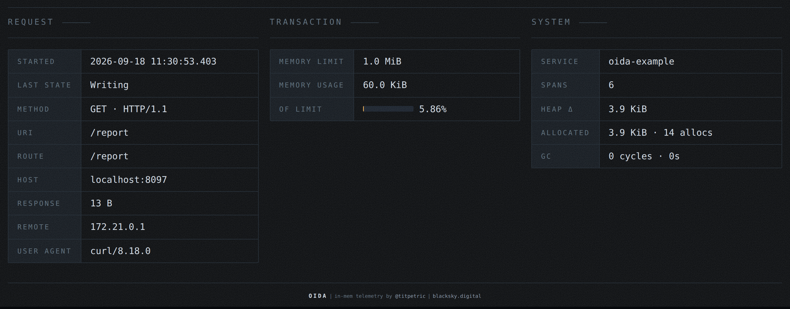

# Screenshots

What `/debug/oida` looks like in a running service. Every shot below is the demo
under load, captured at 1440px in the dark theme. The dashboard also supports a
light theme.

## The masthead

Who this process is, what it has served, and what it is costing: service name,
PID, Go version, goroutines and uptime on the top line, then requests, sampling,
SLA, heap, GC and the memory a trace costs on average. The host switcher beside
the wordmark narrows every view below it to one domain.

## Hosts

The landing page. One row per domain this process has served, with the share of
retained traces it carries, its average and worst response time, and how many
spans a trace records there. Picking a host filters everything else.

## Traces

Everything in the ring buffer, newest first, filterable by text, kind and
status. The shape column is the trace itself: where its time went, by kind, on a
scale shared with every other row, so a trace that spent itself in one place is
recognisable before you read a number. Failures carry their status and colour
the row.

## Statistics

The rolling window, grouped by routed pattern rather than by URI, so
`/users/{id}` is one line and not ten thousand. Count, errors, average and worst
duration, response size, allocations and average span count per route.

## One trace: the drawing

The trace read as audio. Every span is a waveform laid along the stretch it ran
for and mirrored about a shared centre line, so the waves overlay and blend: a
moment with four spans open is hotter than a moment with one. One envelope of
five swells, modulated by how many spans were actually running, carries every
wave, which is what makes them read as takes of the same music rather than
unrelated noise. Loudness rises with nesting depth, so the request is a broad
quiet body and the queries inside it are the bright spikes standing in it.

The shape of a single wave is not data. Its extent, its colour and how loud it
runs are. Underneath sits the time axis it was drawn against.

## One trace: the spans

Under the drawing sits a bar carrying the legend and a count, and behind the
count a switch. Shut, which is how it opens, the bar is the answer: where the
time went, by kind. Thrown, it folds out every span the trace recorded, in tree
order: kind, offset from the start of the request, duration, a bar against the
shared time axis, the source location that opened it, and the name. Attributes
fold out per span, and a recorded error is printed where it happened. The choice
is remembered for the whole front end, so a reader who wants the spans shut has
them shut on every trace they open.

## One trace: the request

Two tables side by side: what was asked for on the left, what it cost this
process on the right. Labels down the left of each, values down the right, one
row per property.

