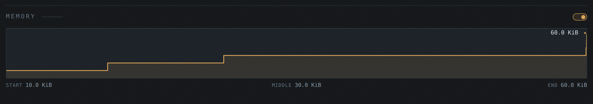
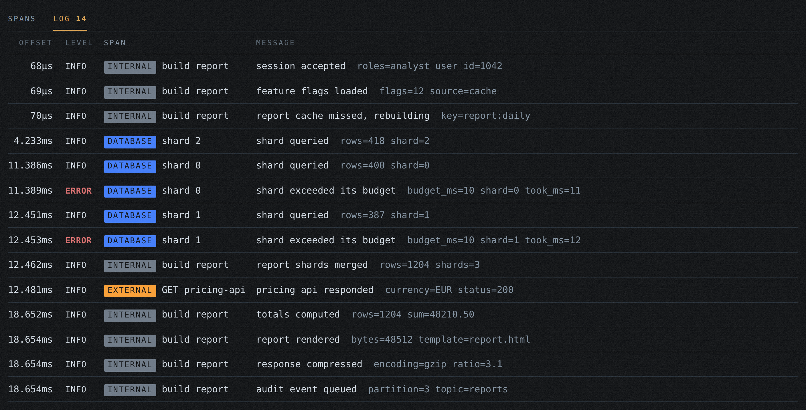
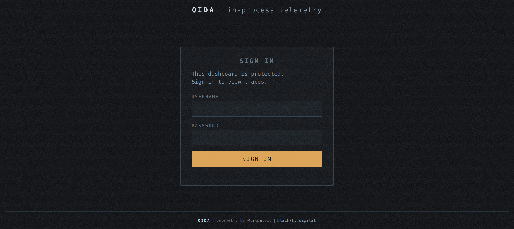

# Screenshots

What `/debug/oida` looks like in a running service. Every shot below is the demo under load, captured at 1440px in the dark theme. The dashboard also supports a light theme.

## The masthead

Who this process is, what it has served, and what it is costing: service name, PID, Go version, goroutines and uptime on the top line, then requests, sampling, SLA, heap, GC and the memory a trace costs on average. The host switcher beside the wordmark narrows every view below it to one domain.

## Hosts

The landing page. One row per domain this process has served, with the share of retained traces it carries, its average and worst response time, and how many spans a trace records there. Picking a host filters everything else.

## Traces

Everything in the ring buffer, newest first, filterable by text, kind and status. The shape column is the trace itself: where its time went, by kind, on a scale shared with every other row, so a trace that spent itself in one place is recognisable before you read a number. Failures carry their status and colour the row.

## Statistics

The rolling window, grouped by routed pattern rather than by URI, so `/users/{id}` is one line and not ten thousand. Count, errors, average and worst duration, response size, allocations and average span count per route.

## One trace: the drawing

The trace read as audio. Every span is a waveform laid along the stretch it ran for and mirrored about a shared centre line, so the waves overlay and blend: a moment with four spans open is hotter than a moment with one. One envelope of five swells, modulated by how many spans were actually running, carries every wave, which is what makes them read as takes of the same music rather than unrelated noise. Loudness rises with nesting depth, so the request is a broad quiet body and the queries inside it are the bright spikes standing in it.

The shape of a single wave is not data. Its extent, its colour and how loud it runs are. Underneath sits the time axis it was drawn against.

## One trace: the memory

Drawn when the spans reported `memory_usage`, between the drawing and the spans. Each reading is the memory in use when a span finished, so the line holds flat and steps where a span let go: the step is the span that allocated. The line runs the whole trace, opening at the first reading's level and holding the last to the end. Hovering a stretch of the line names that span. The head line carries the peak, and the limit when the trace recorded one; a limit close to the readings joins the plot as a dashed reference line, but here the 1.0 MiB limit is far above the 60 KiB peak, so the graph keeps the scale of its readings and the limit stays in words. Underneath sits the same time axis the drawing was measured against, each tick carrying the memory in use at that moment beside the time.

## One trace: the spans

Under the drawing sits a bar carrying the legend and a count, and behind the count a switch. Shut, which is how it opens, the bar is the answer: where the time went, by kind. Thrown, it folds out every span the trace recorded, in tree order: kind, offset from the start of the request, duration, a bar against the shared time axis, and the name. Two columns appear when the trace has them, and are not drawn when it does not: the memory in use when each span finished, drawn against the largest reading of the trace, and the source location that opened the span. The demo above reports memory on most of its spans and not on `shard 0`, so the column has a gap and the reading below it steps by two spans' worth. Attributes fold out per span, and a recorded error is printed where it happened. The choice is remembered for the whole front end, so a reader who wants the spans shut has them shut on every trace they open.

## One trace: the log

The spans and the log are two readings of the same transaction, so they share one place on the page: a tab bar switches between them, the spans first, driven by the stylesheet so it works with scripting off. Each entry is what the code wrote through `Info` or `Error` while the request ran: its offset from the start of the trace, its level, the span that was active when it was written wearing its kind's colour, and the message with its key=value attributes. Here a report request tells its whole story, session to audit event, with two shards blowing their budget in red. A trace that wrote nothing shows the tab with a zero and a line saying how to record an entry.

## One trace: the request

Tables side by side: the request details on the left, the request cost on the right. Labels down the left of each, values down the right, one row per property. Between them sits what the transaction recorded about itself, here the memory limit it ran under and what it used of it. A trace that recorded no attributes of its own shows the two tables and no gap where the third would be.

## The sign in screen

Drawn when the service configures authentication, which the demo does with `OIDA_AUTH=username:password`. A browser without a session lands here: one card, labels above the inputs, the one amber action, and none of the recorded data rendered around it. A failed login keeps the username and says what to do next; a successful one sets the session cookie and returns to the page the browser asked for. Scripts and API callers skip the form with an `Authorization: Bearer` token signed with the configured secret.

